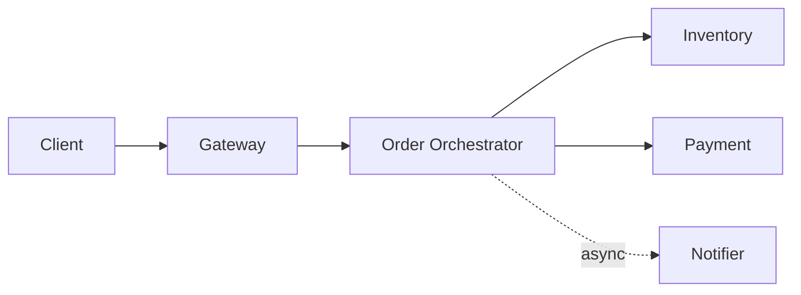
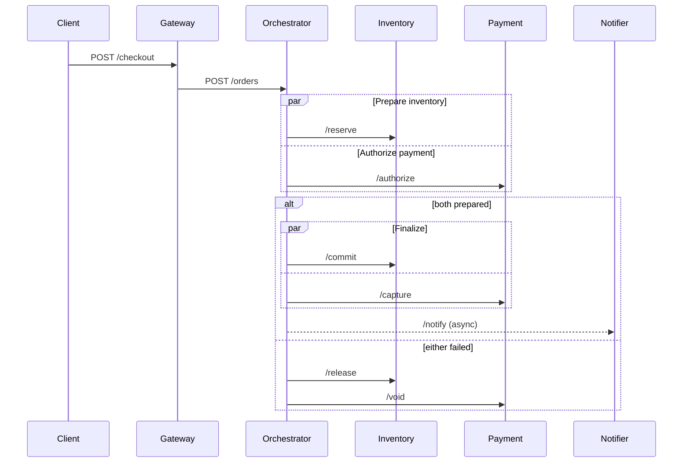

# Distributed Checkout Demo

Five tiny Node.js services demonstrate a distributed checkout saga. Each
service only needs Node 20+ and can run on a different machine.





Run everything locally:

```bash
npm start
curl -s localhost:8080/checkout \
  -H 'content-type: application/json' \
  -d '{"sku":"book","quantity":1,"amount":42}'
```

Run on separate machines by starting one file per host and configuring URLs:

```bash
PORT=8081 INVENTORY_URL=http://inventory:8082 \
PAYMENT_URL=http://payment:8083 NOTIFIER_URL=http://notifier:8084 \
node src/orchestrator.js
```

`amount > 1000` deliberately fails authorization and exercises compensation.

